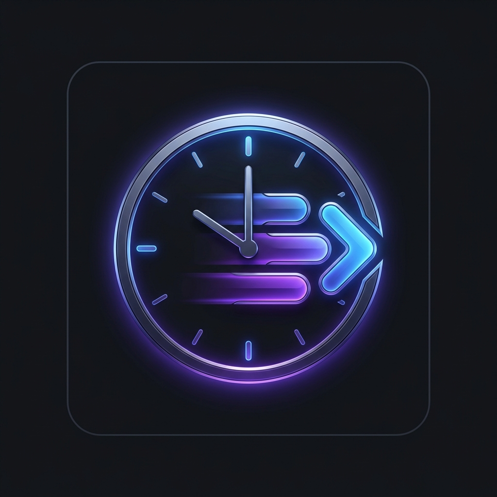

<p align="center">
  
</p>

<h1 align="center">⏱ ChatQueue AI</h1>

<p align="center">
  <strong>An elegant, local-first browser extension that queues your prompts, auto-saves drafts, monitors rate limits, and automatically resumes your conversations the moment your AI Agent is ready.</strong>
</p>

<p align="center">
  <a href="https://github.com/chennuru-tejith/Chat-Queue-AI/blob/main/LICENSE"></a>
  <a href="https://github.com/chennuru-tejith/Chat-Queue-AI/stargazers"></a>
  <a href="https://github.com/chennuru-tejith/Chat-Queue-AI/issues"></a>
  
</p>

---

## ⚡️ Key Features

*   🔄 **Smart Rate-Limit Auto-Resume**: Automatically monitors for usage limit banners (supporting Claude, ChatGPT, Gemini, and DeepSeek), sleeps during limits, and types + sends your prompt the second the AI agent becomes available.
*   📝 **Gmail-like Drafts Auto-Saving**: Never lose a prompt! Automatically auto-saves your prompt draft, chat URL, interval, and resets on every keystroke. Changes are synced in real-time between the popup and the in-page panel.
*   🔌 **Active AI Composer Sync**: Automatically grabs whatever query you typed into the AI's native composer when the extension loads. Clicking the **🔄 Sync AI Input** button instantly fetches the latest text from the active AI input box.
*   📚 **Interactive Prompt History**: A persistent log of recently sent prompts. Click any previous prompt in the Settings panel to instantly reload the draft and queue configuration.
*   🎛 **Maximalistic Control Panel**: Toggle preferences on the fly—enable/disable Sound Chimes, toggle Floating Action Badges on chat pages in real-time, or clear parameters with one click.
*   📊 **Native Composer Progress Bar**: Sleek Session (5h) and Weekly (7d) usage bars injected directly below Claude's input box (with dynamic API querying).
*   🕒 **Absolute Reset Time Parsing**: Reads absolute limit times (e.g. `until 4:30 AM` or `in 15 minutes`) and calculates dynamic countdown timers automatically.
*   🔏 **Local-First & Private**: Direct browser-to-API communication using your active session. No telemetry, tracking, or external servers.
*   💡 **Prompt Template Library**: Instant-access preset chips ("Continue coding", "Debug error", etc.) + custom template save slot.
*   💬 **Live Conversation Stats**: View messages count and total estimated tokens inside a beautiful floating badge.
*   🔔 **Sound Chime & Desktop Notifications**: Soft harmonic arpeggios play and chrome notifications trigger when your prompt successfully sends.
*   ⌨️ **Quick Keyboard Shortcuts**: Toggle panel (`Alt+Shift+R`) and start/stop ChatQueue AI (`Alt+Shift+S`) instantly.

---

## 📸 visual Tour

<p align="center">
  
</p>

- **Setup Panel**: Standard glassmorphism configuration card for entering Chat URLs, editing prompts, and applying templates.
- **Settings Dashboard**: Access preferences (Sound alerts, FAB toggle, Auto-capture toggle) and scroll through your past **Prompt History** log list.
- **Status Dashboard**: Live monitoring feedback showing active wait times, count down tickers, and retry attempts.
- **Log Terminal**: Real-time terminal reporting on limit detections, status changes, and prompt submission results.

---

## 🚀 Quick Start

### 1. Install locally (Developer Mode)
1.  [📥 Download the Pre-packaged ZIP](https://github.com/chennuru-tejith/Chat-Queue-AI/raw/main/chatqueue-ai.zip) and extract it (or clone this repository) to your local machine.
2.  Open Chrome (or Brave, Edge, Opera) and navigate to `chrome://extensions`.
3.  Toggle the **Developer mode** switch in the top-right corner.
4.  Click **Load unpacked** in the top-left and select the extracted folder (where `manifest.json` is located).

### 2. How to Use
1.  Open the AI chat page you want to automate (e.g., [claude.ai](https://claude.ai), [chatgpt.com](https://chatgpt.com), [gemini.google.com](https://gemini.google.com), or [chat.deepseek.com](https://chat.deepseek.com)).
2.  Click the violet **ChatQueue AI** clock icon in the top-right header (or the floating action button fallback in the bottom-right).
3.  Configure your settings:
    *   **Chat URL**: Click **Use current** to lock in your active conversation.
    *   **Resume Prompt**: Write what the agent should receive when it wakes up (or click one of our preset chips).
    *   **Resets In**: Auto-detected from the page limit banner or utilization statistics!
4.  Click **▶ Start ChatQueue AI**.
5.  Sit back! You can safely focus on other tabs, and the extension will automatically type, submit, notification-chime, and refocus the chat when the limit resets.

---

## 🛠 Repository Structure

```text
├── manifest.json       # Extension metadata & permissions
├── background.js       # Background service worker (alarms, tabs, limits)
├── content.js          # In-page UI, limit checkers, API fetchers
├── icons/              # Extension logo icons (16x16, 48x48, 128x128)
├── assets/             # Marketing banner and visual assets
├── popup/              # Toolbar popup UI (html, js, css)
├── LICENSE             # Project license
└── README.md           # Documentation
```

---

## 🗺 Roadmap & Upcoming Features

- [ ] **Multi-Prompt Queueing**: Chain multiple prompts in sequence to execute one after the other as limits reset.
- [ ] **Custom Notification Soundboards**: Choose from a list of chime styles or upload custom `.mp3` alerts.
- [ ] **Advanced Scheduling**: Delay prompt queues to send at specific calendar times.
- [ ] **Syncing across Devices**: Option to backup templates and settings to Chrome Cloud Storage.

---

## 🤝 Contributing

Contributions, issues, and feature requests are welcome! Feel free to check the [issues page](https://github.com/chennuru-tejith/Chat-Queue-AI/issues).

If you find this project helpful, please give it a ⭐️ on GitHub! It helps more developers discover the tool.

## 📄 License

This project is licensed under the [MIT License](LICENSE).
